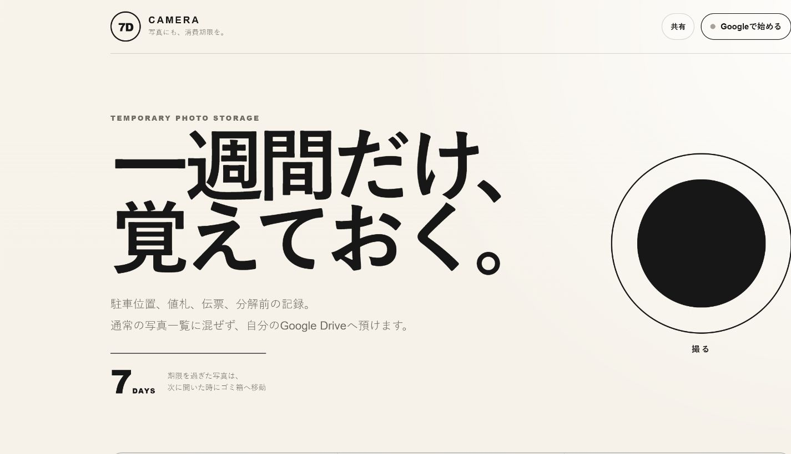

# 7D CAMERA

**写真にも、消費期限を。**

駐車位置、値札、伝票、分解前の記録など、「一週間だけ残ればよい写真」を通常の写真一覧に混ぜず、利用者本人のGoogle Driveへ保存するPWAです。

[公開版を開く](https://7d-camera.pages.dev/) · [プライバシーポリシー](https://7d-camera.pages.dev/privacy.html) · [利用規約](https://7d-camera.pages.dev/terms.html)



## コンセプト

普通のカメラは、撮った写真をすべて残そうとします。しかし、日常の写真には「役目が終われば消えてよいもの」も多くあります。

7D CAMERAは、そうした写真を最初から一時保存として扱います。必要になった写真だけを`KEEP`へ移し、それ以外は期限後の次回起動時にGoogle Driveのゴミ箱へ移します。

> 保存しないのではない。役目が終わるまで預ける。

## 主な機能

- iPhone／Android共通のPWA
- カメラ撮影または写真選択
- 長辺2560pxのJPEGへ軽量化
- 利用者本人のGoogle Driveへ直接アップロード
- `7D CAMERA`と`7D CAMERA/KEEP`フォルダを自動作成
- 残り日数の表示
- KEEP、即時削除、URL共有
- ホーム画面への追加案内
- 期限切れ写真をGoogle Driveのゴミ箱へ移動
- 初回Google接続後は、翌日以降も起動時にGoogle Driveへ自動再接続

写真そのものはCloudflareを経由せず、ブラウザから利用者本人のGoogle Driveへ直接送信します。Google Drive権限は、アプリ自身が作成したファイルだけを扱う`drive.file`です。

## Google接続の保持

`v0.3.0`からGoogle OAuth 2.0 Authorization Code Flowのオフラインアクセスを使用します。

1. 初回だけGoogleへアクセス許可を行う
2. Googleから受け取った更新トークンを暗号化する
3. 暗号化した更新トークンを利用者端末のHttpOnly Cookieへ保存する
4. 次回起動時、Cloudflare Pages Functionsが更新トークンを使って新しいアクセストークンを取得する
5. ブラウザは新しいアクセストークンでGoogle Driveへ直接アクセスする

更新トークンやアクセストークンを運営者のデータベースやKVへ永続保存する仕組みはありません。

## 利用方法

1. [公開URL](https://7d-camera.pages.dev/)をSafariまたはChromeで開く
2. 初回だけ「Googleで始める」を押す
3. Google Driveへのアクセスを許可する
4. 「撮る」を押して撮影する
5. 残したい写真は期限内にKEEPへ移す

初回設定後は、通常は翌日以降もGoogle接続操作なしで起動できます。Google側で権限を取り消した場合、ブラウザのCookieを削除した場合、またはOAuthクライアント設定を変更した場合は再接続が必要です。

### ホーム画面へ追加

- iPhone：Safariの共有ボタン →「ホーム画面に追加」
- Android：Chromeのメニュー →「アプリをインストール」または「ホーム画面に追加」

LINE、Instagram、Gmailなどのアプリ内ブラウザではPWAを追加できない場合があります。その場合はSafariまたはChromeで開き直してください。

## 構成

```text
スマートフォン
  └─ 7D CAMERA（Cloudflare Pages）
       ├─ 写真 ───────────────→ 利用者本人のGoogle Drive
       │                          ├─ 7D CAMERA
       │                          └─ KEEP
       │
       └─ OAuthのみ
          Cloudflare Pages Functions
               └─ Google OAuth 2.0
```

写真はPages Functionsへ送信しません。Pages FunctionsはGoogle OAuthの認証コード交換とアクセストークン更新だけを担当します。

## Cloudflare / Google 初期設定

Google Cloud ConsoleのOAuth 2.0ウェブクライアントに、次の承認済みリダイレクトURIを追加します。

```text
https://7d-camera.pages.dev/api/oauth/callback
```

Google OAuthクライアントのClient SecretはGitHubへ保存せず、Cloudflare PagesのSecretとして登録します。

```powershell
npx wrangler pages secret put GOOGLE_CLIENT_SECRET --project-name 7d-camera
```

コマンド実行後に表示される入力欄へGoogle OAuthのClient Secretを貼り付けます。その後、Pagesを再デプロイします。

```powershell
npx wrangler pages deploy . --project-name 7d-camera
```

## 削除タイミング

ブラウザを閉じている間に7日を経過しても、その瞬間にはGoogle Driveを操作しません。次に7D CAMERAを開いた際、自動的にGoogle接続を復元し、期限切れ写真をGoogle Driveのゴミ箱へ移します。

`apps-script/Code.gs`は、自分専用に毎日整理を追加したい場合の任意ファイルです。一般利用者には設定を求めないでください。

## ファイル構成

```text
.
├─ index.html
├─ app.js
├─ auth-persistence.js
├─ styles.css
├─ config.js
├─ sw.js
├─ _routes.json
├─ functions/
│  └─ api/oauth/
│     ├─ start.js
│     ├─ callback.js
│     └─ session.js
├─ manifest.webmanifest
├─ privacy.html
├─ terms.html
├─ icons/
├─ apps-script/
├─ docs/images/
└─ deploy_7D_CAMERA.ps1
```

## 現在のバージョン

`v0.3.0`

- Google OAuth Authorization Code Flowへ移行
- オフラインアクセス用refresh tokenに対応
- refresh tokenを暗号化HttpOnly Cookieとして利用者端末に保持
- 起動時にCloudflare Pages Functionsでaccess tokenを自動更新
- Pages FunctionsはOAuth処理のみ。写真は従来どおりブラウザからGoogle Driveへ直接送信
- OAuth APIをService Workerキャッシュ対象から除外

## 注意事項

- Google Driveの空き容量を使用します。
- ゴミ箱へ移した写真は、Google Drive側の仕様に従って保持・削除されます。
- Google側でアクセス権限を取り消した場合やCookieを削除した場合は再接続が必要です。
- OAuthやCloudflareの管理画面は変更される場合があります。
- フォークして利用する場合は、自分のOAuthクライアントID、Client Secret、公開URLへ差し替えてください。
